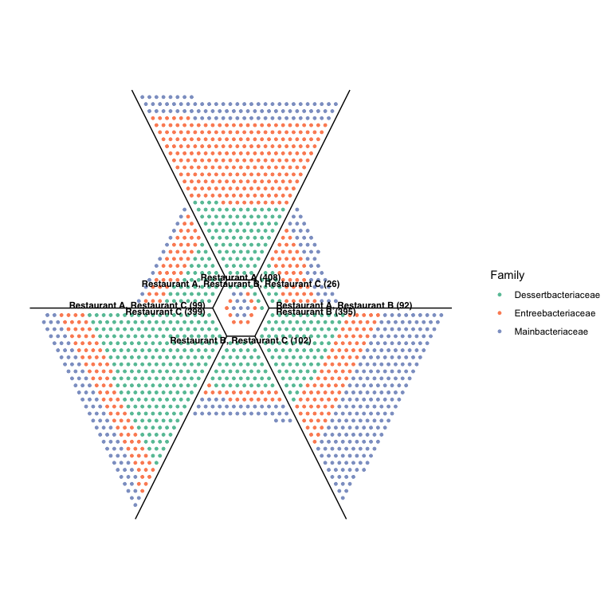

A union plot is like a Venn diagram, in that it shows the overlap
between three groups. Unlike a Venn diagram, the number of overlapping
members is not indicated by a number but by a point drawn for each
member, which can then be coloured by a factor of interest. If there are
too many members to display easily, each point can represent more than
one member (as in the example above).

The package is designed for displaying microbial ecology data (OTUs in
samples), but can be adapted for other applications.

# Installation

Install unionplot from GitHub:

``` r
devtools::install_github("wilkox/unionplot")
```

# Walkthrough

For any union plot, you’ll need a data frame containing at least these
columns: - A factor column named ‘OTU’, containing the OTUs (or other
set members); - A factor column, containing exactly three levels, which
will be the three groups in the plot; - A factor column, by which the
points will be coloured.

Union plots only display presence/absence of an OTU (or other set
member), not counts. Any ‘Count’ or ‘Relative abundance’ column will be
ignored. Any row in the data frame containing an OTU and a sample will
be assumed to imply that the OTU is present in that sample. So, if your
OTU table contains rows with count or relative abundance ‘0’ should be
filtered out before drawing the plot.

For this example plot, we’ll use a randomly generated OTU table with
three samples and three taxonomic families.

``` r
library(unionplot)
data(OTUTable)
head(OTUTable)
#>         Sample     OTU              Family Count
#> 1 Restaurant A    OTU1  Entreebacteriaceae     1
#> 2 Restaurant A  OTU100  Entreebacteriaceae     1
#> 3 Restaurant A OTU1001 Dessertbacteriaceae     3
#> 4 Restaurant A OTU1006 Dessertbacteriaceae     1
#> 5 Restaurant A  OTU101  Entreebacteriaceae     1
#> 6 Restaurant A OTU1036 Dessertbacteriaceae     1
```

Drawing the plot is accomplished with the `unionplot()` function:

``` r
unionplot(OTUTable, group = "Sample", colour = "Family")
```

<!-- -->

The plot is drawn with ggplot, so you can save it easily with `ggsave`.

The plot includes labels for each region, but they’re placed with no
consideration for aesthetics so you’ll probably need to do some
polishing work in a vector graphics program. The number in parentheses
is the actual number of OTUs in each region, and does not change even if
the points represent more than one OTU (the `collapse` argument).
